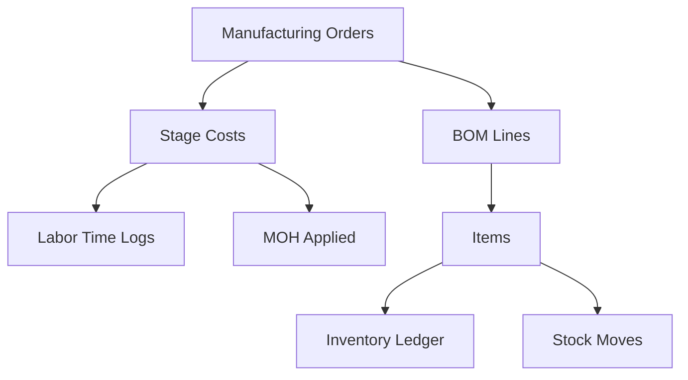

# 🏭 Wardah Process Costing ERP

**Advanced Manufacturing ERP System with Process Costing & AVCO Integration**

[](https://github.com/6thd/wardah-process-costing/actions)
[](https://www.typescriptlang.org/)
[](https://react.dev/)
[](https://supabase.com/)

## 🎯 **Project Overview**

Wardah ERP is a comprehensive manufacturing system designed for **process costing**, **inventory management**, and **multi-stage production tracking**. Built with modern technologies and enterprise-grade security.

### **Key Features**
- 🏭 **Advanced Process Costing** - Multi-stage manufacturing with transferred-in costs
- 📊 **AVCO Inventory Management** - Real-time average costing with full audit trail
- 🔐 **Multi-tenant Architecture** - Secure RLS with JWT-based tenant isolation
- 🌍 **Multilingual Support** - Arabic (RTL) and English with i18next
- ⚡ **Real-time Updates** - Live data synchronization via Supabase
- 📱 **Responsive Design** - Works on desktop, tablet, and mobile

## 🚀 **Quick Start**

### **Prerequisites**
- Node.js 20+ LTS
- npm 9+
- Supabase account (for database)

### **Installation**
```bash
# Clone the repository
git clone https://github.com/6thd/wardah-process-costing.git
cd wardah-process-costing

# Install dependencies
npm install

# Setup environment variables
cp .env.example .env.local
# Edit .env.local with your Supabase credentials

# Start development server
npm run dev
```

### **Environment Configuration**
Create `.env.local` file:
```bash
VITE_SUPABASE_URL=https://your-project.supabase.co
VITE_SUPABASE_ANON_KEY=your-anon-key-here
VITE_APP_ENV=development
```

## 🏗️ **Architecture**

### **Technology Stack**
- **Frontend**: React 18 + TypeScript + Vite
- **Styling**: Tailwind CSS + shadcn/ui
- **Database**: Supabase (PostgreSQL)
- **State Management**: Zustand + React Query
- **Authentication**: Supabase Auth with RLS
- **Internationalization**: i18next

### **Project Structure**
```
src/
├── core/                    # Core infrastructure
│   ├── config.ts           # Dynamic configuration management
│   ├── supabase.ts         # Supabase client with security
│   ├── security.ts         # JWT validation & tenant extraction
│   └── utils.ts            # Common utilities
├── domain/                  # Business logic layer
│   ├── inventory/
│   │   └── avco.ts         # AVCO inventory costing
│   └── manufacturing/
│       └── processCosting.ts # Multi-stage process costing
├── ui/
│   └── events.ts           # Unified event system (data-action)
├── features/               # React components by feature
│   ├── manufacturing/
│   ├── inventory/
│   ├── purchasing/
│   └── sales/
└── types/                  # TypeScript definitions
```

## 🔒 **Security Features**

### **Multi-tenant Security**
- JWT-based tenant extraction from Supabase tokens
- Row Level Security (RLS) on all database tables
- Secure RPC functions with tenant validation
- Rate limiting and input sanitization

### **Data Protection**
- No hardcoded credentials in codebase
- Environment-based configuration
- Audit trails for all transactions
- Comprehensive error handling

## 🏭 **Manufacturing Process Costing**

### **Stage-based Costing Model**
```
Stage 10: Rolling Station        → Direct Materials Entry Point
Stage 20: Transparency Processing → Transferred-in + Labor + OH
Stage 30: Lid Formation         → Transferred-in + Labor + OH
Stage 40: Container Formation   → Transferred-in + Labor + OH
Stage 50: Regrind Processing    → Waste/Rework Processing
```

### **Cost Components**
- **Transferred-In Costs**: From previous manufacturing stage
- **Direct Materials**: Raw materials (Stage 10 only)
- **Direct Labor**: Worker hours × hourly rates
- **Manufacturing Overhead**: Applied based on various allocation methods
- **Regrind Processing**: Waste/rework handling costs
- **Waste Credits**: Value recovered from saleable waste

### **Cost Flow Example**
```typescript
// Stage 10 (Entry Point)
Total_Cost = Direct_Materials + Direct_Labor + Manufacturing_OH
Unit_Cost = Total_Cost / Good_Quantity

// Stage 20+ (Subsequent Stages)
Total_Cost = Transferred_In + Direct_Labor + Manufacturing_OH + Regrind - Waste_Credit
Unit_Cost = Total_Cost / Good_Quantity
```

## 📊 **AVCO Inventory System**

### **Average Cost Calculation**
```typescript
// Incoming Stock (Purchase/Production)
New_Qty = Current_Qty + Incoming_Qty
New_Value = Current_Value + (Incoming_Qty × Unit_Cost)
New_Avg_Cost = New_Value / New_Qty

// Outgoing Stock (Sales/Consumption)
Issue_Cost = Outgoing_Qty × Current_Avg_Cost
New_Qty = Current_Qty - Outgoing_Qty
New_Value = Current_Value - Issue_Cost
```

### **Supported Transaction Types**
- Purchase receipts
- Material consumption for production
- Finished goods from manufacturing
- Sales deliveries with COGS calculation
- Inventory adjustments
- Inter-location transfers

## 🎛️ **Event System**

### **Unified data-action Pattern**
```html
<!-- Manufacturing Actions -->
<button data-action="mo-create" data-param-item-id="123">Create MO</button>
<button data-action="stage-save-labor" data-param-mo-id="456">Record Labor</button>
<button data-action="stage-recalc" data-param-stage="20">Recalculate Stage</button>

<!-- Inventory Actions -->
<button data-action="stock-move-in" data-param-item-id="789">Receive Stock</button>
<button data-action="stock-adjust" data-param-reason="cycle-count">Adjust Inventory</button>
```

### **Event Handlers**
- Automatic form data extraction
- Security validation and rate limiting
- Error handling with user-friendly messages
- Loading states and success notifications
- Custom event broadcasting for UI updates

## 🗄️ **Database Schema**

### **Core Tables**
- `users` - Authentication and user management
- `items` - Master item data with AVCO costs
- `work_centers` - Manufacturing stages/stations
- `manufacturing_orders` - Production orders
- `stage_costs` - Process costing by stage
- `inventory_ledger` - AVCO transaction history
- `boms` & `bom_lines` - Bills of materials
- `labor_time_logs` - Worker time tracking
- `moh_applied` - Manufacturing overhead application

### **Relationships**


## 🚀 **Available Scripts**

```bash
# Development
npm run dev          # Start development server
npm run build        # Build for production
npm run preview      # Preview production build

# Code Quality
npm run lint         # Lint code
npm run lint:fix     # Auto-fix lint issues
npm run type-check   # TypeScript validation
npm run format       # Format code with Prettier

# Testing
npm run test         # Run unit tests
npm run test:ui      # Run tests with UI
npm run e2e          # Run end-to-end tests
```

## 🗂️ **Database Setup**

### **Schema Installation**
```bash
# Run SQL scripts in order:
1. sql/09_complete_schema.sql      # Tables, indexes, RLS policies
2. sql/10_secure_rpc_functions.sql # Secure stored procedures
3. sql/11_sample_data.sql          # Demo data (optional)
```

### **RLS Policies**
All tables are protected with Row Level Security:
```sql
-- Example policy
CREATE POLICY "tenant_select" ON stage_costs
FOR SELECT USING (tenant_id = (auth.jwt() ->> 'tenant_id')::uuid);
```

## 🔧 **Configuration**

### **Dynamic Configuration**
The system uses `public/config.json` for runtime configuration:
```json
{
  "SUPABASE_URL": "https://your-project.supabase.co",
  "SUPABASE_ANON_KEY": "your-anon-key-here",
  "TABLE_NAMES": {
    "items": "items",
    "manufacturing_orders": "manufacturing_orders"
  },
  "FEATURES": {
    "realtime_updates": true,
    "multi_tenant": true,
    "demo_mode": true
  }
}
```

## 🌍 **Internationalization**

### **Supported Languages**
- **Arabic** (ar) - Default with RTL support
- **English** (en) - Full translation coverage

### **Adding Translations**
```typescript
// src/locales/ar/translation.json
{
  "manufacturing": {
    "createOrder": "إنشاء أمر تصنيع",
    "stages": "المراحل"
  }
}
```

## 🚨 **Security Checklist**

**Before Production Deployment:**
- [ ] Remove demo authentication code
- [ ] Set up proper environment variables
- [ ] Configure Supabase RLS policies
- [ ] Enable rate limiting
- [ ] Review and rotate API keys
- [ ] Setup monitoring and logging
- [ ] Configure database backups

See [`SECURITY_CHECKLIST.md`](SECURITY_CHECKLIST.md) for complete details.

## 🧪 **Testing**

### **Testing Strategy**
- **Unit Tests**: Business logic and utilities
- **Integration Tests**: Database operations and API calls
- **E2E Tests**: Complete user workflows
- **Component Tests**: React component behavior

### **Demo Credentials**
```
Email: admin@wardah.sa
Password: admin123
```
⚠️ **Remove in production!**

## 📈 **Performance**

### **Optimization Features**
- Code splitting with React.lazy
- Database indexing for tenant queries
- Realtime subscription management
- Efficient AVCO calculations
- Optimized SQL with proper joins

## 🛠️ **Development**

### **Adding New Features**
1. Create domain logic in `src/domain/`
2. Add secure RPC functions in `sql/`
3. Register UI actions in `src/ui/events.ts`
4. Build React components in `src/features/`
5. Add translations in `src/locales/`
6. Write tests in `__tests__/`

### **Code Style**
- TypeScript strict mode
- ESLint + Prettier configuration
- Functional programming patterns
- Comprehensive error handling

## 📚 **Documentation**

- [`SECURITY_CHECKLIST.md`](SECURITY_CHECKLIST.md) - Security guidelines
- [`SAP_IMPLEMENTATION_GUIDE.md`](SAP_IMPLEMENTATION_GUIDE.md) - ERP comparison
- [`sql/`](sql/) - Database documentation
- [GitHub Repository](https://github.com/6thd/wardah-process-costing)

## 🤝 **Contributing**

1. Fork the repository
2. Create a feature branch
3. Make your changes
4. Add tests
5. Submit a pull request

See issues for current development priorities.

## 📄 **License**

This project is licensed under the MIT License - see the [LICENSE](LICENSE) file for details.

## 🙏 **Acknowledgments**

- [Supabase](https://supabase.com/) for the backend infrastructure
- [shadcn/ui](https://ui.shadcn.com/) for the component library
- [Tailwind CSS](https://tailwindcss.com/) for styling
- [React](https://react.dev/) team for the framework

---

**Built with ❤️ for manufacturing excellence**

*For questions or support, please open an issue on GitHub.*