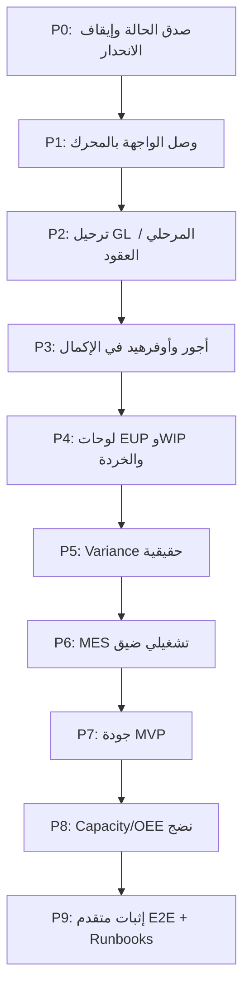

# خطة الوصول لمستوى متقدم — موديول التصنيع وتكاليف المراحل

**الحالة:** مسودة تنفيذية معتمدة على تدقيق المستودع  
**آخر تحديث:** 2026-08-06  
**النطاق:** Manufacturing + Process Costing + MES المرتبط بالتكلفة  
**خارج النطاق المباشر:** ZATCA، المبيعات الكاملة، CRM، الأصول الثابتة  

---

## 0) الهدف والمعيار الذهبي

### الهدف
تحويل موديول التصنيع من «محرك SQL قوي + واجهة غير مكتملة الاتصال» إلى **منتج تصنيع عملياتي متقدم** يمكن الدفاع عن أرقامه أمام محاسب مصنع ومراجع داخلي، ومقارنته جديًا مع حلول متوسطة متخصصة (وما فوق Odoo Manufacturing في Niche تكاليف المراحل).

### تعريف «مستوى متقدم» (Definition of Done للمنتج)
يُعتبر المستوى المتقدم محققًا فقط إذا تحققت **كل** الشروط التالية معًا:

| # | الشرط | قياس القبول |
|---|--------|-------------|
| A | مسار الواجهة الحي يستخدم محرك DB القانوني | زر الحساب في `/manufacturing/process-costing` يستدعي `upsert_stage_cost` (أو wrapper آمن) ويمرّر WIP/% إتمام/خردة/FIFO |
| B | لا يوجد حساب تكلفة مرحلة مبسّط `total/goodQty` في المسار الإنتاجي | حذف أو عزل المسار المباشر إلى `stage_costs` من الـ service الحي |
| C | إكمال أمر التصنيع يضم المواد + الأجور + الأوفرهيد (حسب سياسة محددة) | `rpc_complete_manufacturing_order` يرحّل أحداث تحويل تكلفة غير المواد، أو مسار مرحلي معادل موثّق |
| D | شاشات العلم (EUP / Variance / Quality الأساسية) ليست stubs | لا `mock*` ولا `comingSoon` على المسارات الجانبية الرئيسية للتصنيع |
| E | WIP متعدد المراحل قابل للتدقيق | تقرير/عرض يطابق `stage_costs` + حركة المخزون/GL دون تسوية يدوية خارج النظام للحالات المدعومة |
| F | بوابة اختبار تمنع الانحدار | اختبارات وحدة + عقد RPC + سيناريو E2E واحد على الأقل لـ: إدخال مرحلة → EUP → إكمال أمر → أثر مخزون/GL |
| G | وثائق التشغيل محدّثة وصادقة | تحديث `PROCESS_COSTING_LIMITATIONS.md` لإزالة الادعاءات التي تتعارض مع مسار الواجهة الحي |

### مبدأ حوكمة النشر (إلزامي في هذا المستودع)
- أي RPC/Schema جديد: **PR قاعدة بيانات مستقل → دمج → تطبيق Production → تحقق → ثم PR الواجهة**.
- لا تُدمج واجهة تعتمد على RPC غير مطبّق.
- لا تُعدَّل migrations مطبّقة حيًا؛ أضف رقمًا جديدًا بعد `171`.
- الكتابة التشغيلية داخل RPC ذري واحد؛ لا تفصل SLE/bin/product/GL على طلبات مستقلة.

---

## 1) خط الأساس الحالي (As-Is) — لا تُخطَّط فوق وهم

### 1.1 ما هو REAL اليوم

| القدرة | الدليل |
|--------|--------|
| أوامر تصنيع + آلة حالات | `rpc_transition_mo_status` / `validate_mo_transition` |
| حجز واستهلاك مواد fail-closed | `rpc_create_mo_with_reservation`, `rpc_consume_reserved_materials(_v2)` |
| إكمال أمر: مواد → WIP → FG + GL | `rpc_complete_manufacturing_order` (migration `93` وما بعدها) |
| BOM / Routing / Work Centers / Stages / Standard Costs / WIP Log CRUD | مسارات `/bom`, `/routing`, `/workcenters`, `/stages`, `/standard-costs`, `/wip-log` |
| محرك EUP (متوسط موزون) | migration `67` → `upsert_stage_cost` |
| خردة طبيعية/غير طبيعية | migration `68` |
| FIFO لـ WIP | migration `69` + `manufacturing_orders.costing_method` |
| تقرير تكلفة الإنتاج (RPC) | migration `80` → `rpc_cost_of_production_report` + صفحة `/cost-of-production` |
| MES: بدء/إكمال/إيقاف عملية | `mesService` + `WorkCenterDashboard` + جداول migration `73` |

### 1.2 ما هو PARTIAL

| القدرة | العيب الحالي |
|--------|--------------|
| شاشة تكاليف المراحل | تحسب في العميل `unitCost = totalCost / goodQty` وتكتب `stage_costs` مباشرة (`process-costing-service.ts`) — **تتجاوز** محرك EUP/FIFO/Scrap |
| مسار بديل يستدعي RPC | موجود في `src/ui/events.ts` (`stage-recalc`) لكنه **ليس** مسار زر الحساب الأساسي |
| Capacity / Efficiency | تعتمد على بيانات shop وcalendars؛ البنية موجودة، النضج التشغيلي ناقص |
| `wip_by_stage` | مبسّط (migration `109`)؛ لا يعكس EUP المرحلي الكامل ولا جداول أجور/أوفرهيد المفقودة في ذلك المسار |
| MES | كونسول أوامر عمل؛ بلا واجهة حية لـ downtime / operator sessions / QC / clock-in |

### 1.3 ما هو STUB أو فجوة صريحة

| العنصر | الموقع / الدليل |
|--------|------------------|
| Equivalent Units UI | `equivalent-units-dashboard.tsx` — Temporary stub |
| Variance Alerts | `variance-alerts.tsx` — `mockVarianceAlerts` |
| Quality page | `manufacturing/index.tsx` — `comingSoon` |
| ترحيل مرحلة إلى GL من اللوحة | `stage-costing-actions.js` → `postStageToGL` stub |
| Domain import معطّل | تعليقات `DISABLED (not implemented)` في stage-costing-actions / EU dashboard |
| أجور + أوفرهيد + WIP متعدد المراحل داخل إكمال الأمر | تعليق migration `93`: «بناء لاحق» |
| تبويب مقارنة FIFO في التقارير | معطّل / under development |
| تقرير process-costing القديم | `process-costing-report.tsx` — بيانات mock |

### 1.4 التناقض الوثائقي الواجب إصلاحه مبكرًا
`docs/architecture/PROCESS_COSTING_LIMITATIONS.md` يعلن EUP/FIFO/Scrap «Compliant / Implemented» على مستوى المحرك، بينما مسار الواجهة الحي ما زال على الصيغة القديمة.  
**قاعدة هذه الخطة:** لا تُعلَن ميزة «مكتملة للمنتج» إلا إذا كان المسار الحي + الاختبار + الـ runbook متسقين.

---

## 2) المعمارية المستهدفة (To-Be)

```text
[UI Stage Costing Panel]
        │  (params كاملة: qty, wip, %, scrap, regrind, waste, method)
        ▼
[processCostingService] ──► فقط orchestration + عرض
        ▼
[upsert_stage_cost / _core] ──► الحساب القانوني الوحيد للتكلفة المرحلية
        │
        ├─► stage_costs (EUP, scrap split, method fields)
        ├─► labor_time_logs / moh_applied (مصادر تكلفة)
        └─► (لاحقاً) أحداث GL مرحلية أو عند الإكمال

[MES ops] ──► labor_time_tracking / material_consumption
        │         (يجب توحيد أو جسر واضح مع labor_time_logs)
        ▼
[rpc_complete_manufacturing_order]
        ├─ MATERIAL_ISSUE
        ├─ CONVERSION / OH / STAGE_TRANSFER (جديد)
        └─ FG_RECEIPT

[Reports]
  CoP RPC · EUP breakdown · WIP by stage · Scrap · Variance (من بيانات حية)
```

### قرارات تصميم مُلزمة قبل التنفيذ

| قرار | الخيار الافتراضي في هذه الخطة | بديل مرفوض |
|------|-------------------------------|------------|
| مصدر الحقيقة لتكلفة المرحلة | RPC `upsert_stage_cost` فقط | حساب العميل ثم upsert مباشر |
| نموذج الأجور | جسر MES → `labor_time_logs` (أو توحيد جدول واحد بـ migration) | إبقاء نموذجين بلا عقد |
| ترحيل GL المرحلي | خيار أ: ترحيل عند «Post Stage» الذري؛ خيار ب: تجميع عند إكمال الأمر | stub نجاح كاذب |
| WIP محاسبي | حساب WIP عام موجود + تتبّع مرحلي في `stage_costs` أولًا؛ حسابات WIP per-stage لاحقًا إن لزم | تغيير دليل الحسابات بلا عقد أحداث |
| الجودة | MVP فحص مرتبط بأمر العمل/الأمر (قبول/رفض/خردة) قبل جناح QC كامل | صفحة comingSoon دائمة في الشريط |

---

## 3) خارطة المراحل (Phased Delivery)

> لا تقديرات زمنية بالأيام/الأسابيع. المقياس: **مخرجات + معايير قبول + تبعيات + نوع PR (DB/UI)**.



---

## P0 — صدق الحالة وإيقاف الانحدار (بلا ميزات جديدة)

**الغرض:** منع بيع/اختبار مسار كاذب، وتثبيت خط أساس قابل للقياس.

### المهام
1. تحديث `PROCESS_COSTING_LIMITATIONS.md`:
   - فصل صريح: «محرك DB ✅» مقابل «مسار UI الحي ❌».
   - تعليم Phase 4 كـ مفتوح مع تبعيات P1–P4.
2. إضافة علم داخلي أو تحذير UI في `/process-costing` عند استخدام المسار المبسط (إلى أن يُستبدل).
3. جرد اختبارات تغطي المسار الخاطئ حاليًا وتوثيق أنها تختبر الـ bypass لا المحرك.
4. قائمة «شاشات محظور عرضها في ديمو العميل» حتى إغلاق الـ stub:
   - `/equivalent-units`
   - `/variance-alerts`
   - `/quality`
5. ربط هذه الوثيقة من `docs/architecture/README.md` و/أو فهرس التصنيع إن وُجد.

### معايير القبول
- [ ] وثيقة Limitations تعكس الواقع بلا تضارب.
- [ ] لا مسار «نجاح صامت» لـ `postStageToGL` دون تحذير في بيئة غير إنتاجية على الأقل.
- [ ] Checklist ديمو داخلي محدّث.

### نوع التغيير
وثائق + تحذيرات UI اختيارية (بلا اعتماد RPC جديد). يمكن في PR واحد.

---

## P1 — وصل الواجهة بمحرك EUP / Scrap / FIFO ⭐ (أعلى أولوية منتج)

**الغرض:** إلغاء أكبر فجوة مصداقية تنافسية.

### P1-A — طبقة الخدمة (UI PR بعد أي توسيع عقد إن لزم)
**ملفات مركزية:**
- `src/services/process-costing-service.ts`
- `src/features/manufacturing/stage-costing-panel.tsx`
- `src/features/manufacturing/stage-costing-actions.js`
- اختبارات: `process-costing-rpc.test.ts`, `process-costing-service.test.ts`, `stage-costing-panel.test.tsx`

**عقد الإدخال المطلوب من الواجهة إلى RPC** (الأسماء الحالية للمحرك):

| معامل | المعنى | إلزامي؟ |
|-------|--------|---------|
| `moId` / stage | تعريف المرحلة | نعم |
| `goodQty` | كمية تامة جيدة | نعم |
| `p_wip_end_qty` | WIP ختامي | نعم (0 مسموح) |
| `p_wip_end_dm_completion_pct` | % مواد | نعم (0–100) |
| `p_wip_end_cc_completion_pct` | % تحويل | نعم (0–100) |
| `p_wip_beginning_*` | بداية الفترة (FIFO) | عند `costing_method = fifo` |
| `scrap_qty` / rates | خردة | نعم (0 مسموح) |
| `p_regrind_cost` / `p_waste_credit` | إعادة طحن / ائتمان هدر | اختياري |
| قراءة `costing_method` من أمر التصنيع | تحديد الصيغة | نعم |

**سلوك مطلوب:**
1. إزالة القسمة المحلية `totalCost / goodQty` من المسار الإنتاجي.
2. استدعاء `upsert_stage_cost` عبر Supabase RPC (المسار المؤمَّن في migration `120`).
3. عرض قيم الإرجاع: `eup`, `unit_cost`, `normal_scrap_cost`, `abnormal_scrap_cost`, `costing_method`, `current_period_cost`…
4. حفظ مدخلات WIP/% في النموذج وإعادة تحميلها من `stage_costs`.
5. Fail-closed: إن فشل RPC لا تُكتب تكلفة «تقريبية» محليًا.

### P1-B — هل نحتاج migration؟
- إذا كان توقيع `upsert_stage_cost` كافيًا: **لا migration** → UI PR فقط بعد التحقق من Production signature.
- إذا نقصت حقول/صلاحيات EXECUTE/حراسة: **DB PR أولًا** برقم `172+`.

### سيناريوهات قبول رقمية (إلزامية في الاختبارات)

**سيناريو WA + WIP (من الوثيقة الحالية):**
- تكلفة 10,000 · جيدة 800 · WIP ختامي 200 @ 50% CC  
- المتوقع: EUP = 900 · unit ≈ 11.11 · تكلفة تامة ≈ 8,888 · WIP ≈ 1,111

**سيناريو خردة:**
- خردة تتجاوز المعدل الطبيعي لمركز العمل → فصل normal/abnormal كما في migration `68`.

**سيناريو FIFO:**
- أمر بـ `costing_method = fifo` مع beginning WIP → الوحدة من تكلفة الفترة الحالية فقط.

### معايير القبول
- [ ] المسار الحي لا يحتوي `unitCost = totalCost / goodQty` إلا كـ fallback داخل SQL عندما EUP=0.
- [ ] اختبارات RPC الحالية تظل خضراء + اختبارات service جديدة تثبت استدعاء RPC لا الكتابة المباشرة.
- [ ] اختبار لوحة: إدخال WIP يظهر في النتيجة المعروضة.
- [ ] صفحة `/cost-of-production` تطابق آخر `stage_costs` المحسوبة بالمحرك.

### مخاطر
- بيانات قديمة حُسبت بالمسار المبسط قد تختلف بعد إعادة الحساب → وفّر زر «إعادة احتساب المرحلة» واضح الأثر، ولا تُعدّل التاريخ المحاسبي المرحّل صامتًا.

---

## P2 — ترحيل تكلفة المرحلة إلى الأستاذ (إنهاء stub)

**الغرض:** إغلاق `postStageToGL` الكاذب وربط التكلفة بالدفتر القانوني `gl_entries`.

### قرارات قبل الكود
اختر سياسة واحدة وثبّتها في ADR قصير تحت `docs/architecture/`:

| السياسة | متى تُستخدم | التعقيد |
|---------|-------------|---------|
| **S2-A: Post per stage** | صناعات تريد إثبات مرحلي شهري | أعلى (أحداث STAGE_WIP / ABNORMAL_SCRAP) |
| **S2-B: Accrue on MO complete only** | تبسيط أول إصدار متقدم | أقل، يعتمد على P3 |

**التوصية الافتراضية لهذه الخطة:**  
- نفّذ **S2-B أولًا** مع إبقاء زر Post Stage معطّلًا بصراحة أو يكتب إلى مسودة غير مرحّلة.  
- ثم S2-A إن طلب العملاء إثباتًا مرحليًا.

### مهام DB (إن S2-A أو أحداث خردة غير طبيعية)
1. Migration جديدة: event types + mappings (على نمط `MATERIAL_ISSUE` / `FG_RECEIPT`).
2. RPC ذري مثل `rpc_post_stage_cost` أو توسيع مسار موجود:
   - حارس عضوية/صلاحية.
   - منع الترحيل المزدوج (idempotency key: `org_id + stage_cost_id + event_type`).
   - قيد Abnormal Scrap → مصروف فترة (لا يدخل تكلفة الوحدة).
3. Runbook تحت `docs/db/` بفحوص قبل/بعد.

### مهام UI
1. استبدال stub في `stage-costing-actions.js`.
2. حالات الزر: Draft / Posted / Failed مع رسالة خطأ حقيقية.
3. منع تعديل مرحلة مرحّلة إلا بعكس قانوني موثّق (لا حذف صامت).

### معايير القبول
- [ ] لا يوجد `async () => ({ success: true })` في المسار الإنتاجي.
- [ ] اختبار سلبي: ترحيل مكرر مرفوض.
- [ ] اختبار: abnormal scrap لا يضخّم تكلفة المخزون التام.

---

## P3 — الأجور والأوفرهيد وWIP متعدد المراحل داخل الإكمال

**الغرض:** إغلاق الفجوة المعلنة في migration `93`.

### P3-1 توحيد مصادر التحويل (Conversion)
1. جرد الفجوات بين:
   - `labor_time_logs` (process costing)
   - `labor_time_tracking` (MES)
   - `moh_applied`
2. قرار عقد:
   - **إما** view/جسر يغذّي الإكمال من المصدرين،  
   - **أو** migration توحّد الكتابة إلى جدول قانوني واحد.
3. قواعد التقييم:
   - أجور: ساعات × معدل معتمد (مركز عمل / موظف).
   - أوفرهيد: أساس موجود أصلًا (labor_hours / machine_hours / …) من منطق المرحلة.

### P3-2 توسيع `rpc_complete_manufacturing_order` (DB PR)
أضف أحداثًا (أسماء مقترحة — تُثبَّت في الـ migration):
- `CONVERSION_TO_WIP` أو `LABOR_APPLY` / `OH_APPLY`
- `STAGE_TRANSFER` (من مرحلة إلى التالية) عند تعدد المراحل
- الإبقاء على `MATERIAL_ISSUE` و `FG_RECEIPT`

**قيود إلزامية:**
- `FOR UPDATE` على الأرصدة ذات الصلة.
- Fail-closed إن نقص mapping الحسابات.
- لا ترحّل FG بتكلفة مواد فقط إذا كانت سياسة المنظّمة تتطلب التحويل (أو اجعل السياسة `org_settings` صريحة).
- وثّق سلوك الأوامر القديمة (materials-only) عبر flag أو تاريخ قطع.

### P3-3 واجهة
1. ملخص تكلفة الإكمال قبل التأكيد: مواد / أجور / OH / إجمالي وحدة.
2. منع الإكمال إن بقيت مراحل إلزامية بلا `stage_costs` مرحّلة/محسوبة (سياسة قابلة للتكوين).

### معايير القبول
- [ ] أمر متعدد المراحل بمواد+أجور يعطي تكلفة FG ≠ تكلفة المواد فقط.
- [ ] اختبارات عقد SQL + اختبار تكامل خدمة الإكمال.
- [ ] Runbook: ترتيب تطبيق + استعلامات تحقق أرصدة WIP/FG.

---

## P4 — لوحات Process Costing الحقيقية (بديل Phase 4 القديم)

**الغرض:** إكمال ما سمّته Limitations «Phase 4» لكن على بيانات حية بعد P1.

### P4-1 Equivalent Units Dashboard
**استبدل stub في** `equivalent-units-dashboard.tsx`:
- اقرأ من `stage_costs` + تفاصيل EUP (DM/CC) لا من خدمة وهمية.
- جدول تفكيك: Beginning WIP · Started · Completed · Ending WIP · EUP · $/EUP.
- دعم تبديل WA/FIFO حسب الأمر أو الفترة.
- اختبارات عرض + عقد خدمة؛ احذف التعليق `DISABLED (domain not implemented)` بعد وجود repository حقيقي (يمكن إحياؤه تحت `src/domain/manufacturing` إن لزم).

### P4-2 WIP Valuation
- أعد تعريف مصدر `wip_by_stage` (migration جديدة بدل الاعتماد على العرض المبسّط `109` إن لزم).
- يجب أن يطابق: كمية × تكلفة وحدة EUP للمرحلة، مع ربط اختياري بـ `stage_wip_log`.
- اربط صفحة المخزون/التقارير إن كانت تعرض «قريبًا» لنفس المفهوم — لا تكرّر منطقًا متعارضًا.

### P4-3 Scrap Analysis
- لوحة من حقول `normal_scrap_*` / `abnormal_scrap_*`.
- فلترة: مركز عمل / مرحلة / فترة / أمر.

### P4-4 FIFO Comparison
- فعّل التبويب المعطّل فقط بعد أن يصبح المسار الحي يدعم FIFO (P1).
- قارن WA مقابل FIFO لنفس المدخلات (what-if) دون كتابة مزدوجة إلا بطلب صريح.

### P4-5 تنظيف التقارير اليتيمة
- إحالة أو حذف اعتماد `process-costing-report.tsx` المبني على mock من أي قائمة مستخدم نهائية.

### معايير القبول
- [ ] لا stub في `/equivalent-units`.
- [ ] أرقام اللوحة = أرقام `upsert_stage_cost` لنفس الأمر/المرحلة.
- [ ] اختبارات تمنع إعادة إدخال mock charts كمصدر بيانات.

---

## P5 — Variance Alerts حقيقية

**الغرض:** استبدال `mockVarianceAlerts` بمصدر قانوني.

### المهام
1. تفعيل/ضبط RPCs الموجودة (`108` / `111` / `117`) أو استبدالها بعقد أوضح إن كانت تُرجع فراغًا دائمًا.
2. تعريف أنواع الانحراف المدعومة في MVP:
   - كمية مواد (BOM vs actual)
   - تكلفة وحدة (standard_costs vs actual stage)
   - كفاءة وقت (routing standard vs MES actual) — إن توفر P6
3. عتبات في `org_settings` أو جدول عتبات.
4. UI: قائمة حية، حالة open/acked، رابط للأمر/المرحلة، بلا بياناتhardcoded.

### معايير القبول
- [ ] إزالة ثابت `mockVarianceAlerts` من المسار الافتراضي.
- [ ] اختبار: أمر بانحراف مواد فوق العتبة يظهر تنبيهًا واحدًا غير مكرر.
- [ ] اختبار: دون انحراف → قائمة فارغة نظيفة لا أخطاء.

---

## P6 — MES تشغيلي ضيق (عمق قبل اتساع)

**الغرض:** تحويل `/mes` من كونسول جزئي إلى حلقة تغذي التكلفة والجودة لاحقًا.

### نطاق MVP (افعل)
1. توليد أوامر العمل من MO ظاهر في UI (`generate_work_orders_from_mo`).
2. Start / Pause / Resume / Complete عملية (موجود جزئيًا) مع تسجيل كميات جيدة/خردة.
3. Clock-in/out مشغّل مربوط بأمر العمل → يصب في مصدر الأجور القانوني (مخرج P3-1).
4. Backflush مواد للعملية عند الإكمال إن كان BOM/التوجيه يسمح.

### خارج MVP هذه المرحلة (لا توسّع الآن)
- جدولة طاقة متقدمة، صيانة وقائية، لوحات OEE الجمالية بلا بيانات.
- تطبيقات موبايل منفصلة.

### Downtime (شريحة ثانية داخل P6 أو P6.1)
- UI بسيط على `machine_downtime` + سبب + مركز عمل.
- يظهر في Efficiency فقط بعد وجود بيانات حقيقية.

### معايير القبول
- [ ] أمر يُحرَّر → تُولَّد أوامر عمل → تُنفَّذ → تظهر ساعات في مصدر التكلفة المستخدم بالإكمال.
- [ ] لا تعتمد Efficiency على بيانات seed وهمية في الإنتاج.
- [ ] اختبارات خدمة MES للمسارات الجديدة + عزل مستأجر.

---

## P7 — جودة MVP (إنهاء comingSoon)

**الغرض:** جعل حالة `quality_check` في دورة الأمر ذات معنى.

### نطاق MVP
1. فحص مرتبط بـ `quality_inspections` (جدول migration `73`) أو عقد مبسّط:
   - Pass / Fail / Rework
   - كمية مرفوضة → تغذي `scrap_qty` للمرحلة أو أمر العمل
2. بوابة اختيارية: لا إكمال MO إذا فشل فحص إلزامي.
3. صلاحيات RBAC: `manufacturing.quality.*` (أضف عبر migration بيانات مرجعية إن لزم + UI roles).

### خارج النطاق هنا
- ISO كامل، أجهزة قياس، شهادات مورد، SPC إحصائي متقدم.

### معايير القبول
- [ ] `/quality` ليست EmptyState comingSoon.
- [ ] فشل فحص ينعكس على كمية/خردة أو يمنع الإكمال حسب الإعداد.
- [ ] اختبار صلاحيات: مستخدم بلا إذن لا يمرّر الفحص.

---

## P8 — Capacity & Efficiency إلى مستوى تشغيلي

**يعتمد على:** P6 (بيانات حقيقية).

### المهام
1. تقويمات مراكز العمل + ورديات كحد أدنى لـ Capacity.
2. تحميل من أوامر العمل المخططة/المحرَّرة.
3. OEE مبسّط: Availability (من downtime) × Performance × Quality (من P7).
4. إخفاء أو تعليم اللوحات «لا بيانات» بدل أصفار مضللة.

### معايير القبول
- [ ] لوحة الطاقة تفسّر مصدر كل رقم.
- [ ] اختبار تكامل على view/RPC الكفاءة مع عينة بيانات معروفة النتيجة.

---

## P9 — إثبات متقدم، حوكمة، وتغليف تنافسي

**الغرض:** تحويل الإنجاز التقني إلى جاهزية يمكن عرضها وبيعها في Niche التصنيع.

### اختبارات
1. E2E Playwright يتجاوز smoke الحالي في `e2e/process-costing.spec.ts`:
   - إنشاء/اختيار MO  
   - احتساب مرحلة بـ WIP  
   - تنفيذ MES مختصر (إن P6)  
   - إكمال أمر  
   -断言 مخزون/تقرير تكلفة (عبر UI أو API fixture على staging)
2. جناح قبول SQL مماثل لـ UoM/AP acceptance workflows الموجود في CI.
3. تثبيت أرقام ذهبية (golden cases) للـ WA/FIFO/Scrap في CI.

### وثائق
1. Runbook تجميعي: `docs/db/PROCESS_COSTING_ADVANCED_RUNBOOK.md`.
2. تحديث Limitations + ADR للقرارات S2/P3.
3. دليل محاسب مصنع (عربي): من إدخال الأرصدة إلى تقرير تكلفة الإنتاج.
4. تصحيح README العام إن كان يبالغ في «Production Ready» لمسارات stubs.

### ديمو تنافسي (سيناريو قياسي)
مصنع عطور/كيماويات مبسّط أو سيناريو الوثيقة (10,000 / 800 / 200@50%) + مرحلة ثانية + خردة غير طبيعية + إكمال أمر — يُعرض من الواجهة دون SQL يدوي.

### معايير القبول النهائية (= القسم 0)
- [ ] الشروط A–G كلها محابتة.
- [ ] قائمة stubs في الشريط الجانبي للتصنيع = صفر للمسارات المذكورة.
- [ ] Audit داخلي: مقارنة رقم CoP مع ورقة Excel مرجعية لنفس السيناريو ضمن هامش تقريب مقبول وموثّق.

---

## 4) مصفوفة الأولوية والتبعيات

| مرحلة | القيمة التنافسية | التبعية | نوع PR الغالب | يُحظر دمجه مع |
|-------|------------------|---------|---------------|----------------|
| P0 | مصداقية | — | Docs/UI | — |
| P1 | **حاسمة** | P0 مستحسن | UI (+DB إن لزم) | توسيع MES/Quality |
| P2 | عالية | P1 | DB ثم UI | — |
| P3 | **حاسمة** | P1، وجسر أجور | DB ثم UI | — |
| P4 | عالية | P1 | UI (+DB لعرض WIP) | — |
| P5 | متوسطة-عالية | P1 + جزئيًا P6/P7 | DB/UI | — |
| P6 | عالية تشغيليًا | P3-1 للجسر | DB خفيف + UI | OEE الجمالي |
| P7 | متوسطة | P6 مستحسن | DB/UI | جناح ISO |
| P8 | متوسطة | P6+P7 | UI/SQL views | — |
| P9 | إطلاق | P1–P7 كحد أدنى ناضج | CI/Docs/E2E | — |

**المسار الحرج للتميّز التنافسي:** `P1 → P3 → P4 → P9`  
**المسار الحرج للتشغيل اليومي في المصنع:** `P6 → P3-1 → P7 → P8`

---

## 5) تفكيك فجوات ↔ مراحل (Traceability)

| الفجوة الحالية | تُغلق في |
|----------------|----------|
| UI يحسب `total/goodQty` | P1 |
| `postStageToGL` stub | P2 |
| مواد فقط في إكمال الأمر | P3 |
| EU dashboard stub | P4 |
| `wip_by_stage` المبسّط | P4 |
| FIFO report معطّل | P4 |
| mock variance | P5 |
| MES بلا labor/downtime UI | P6 |
| Quality comingSoon | P7 |
| Capacity/OEE بلا نضج | P8 |
| E2E smoke فقط + وثائق متضاربة | P0 + P9 |
| ازدواج `labor_time_logs` vs `labor_time_tracking` | P3-1 / P6 |

---

## 6) سياسات منتج تُثبَّت كتابةً (Product Rules)

1. **لا شاشة في الشريط الجانبي بلا مسار حي.** أخفِ أو انقل إلى «تجريبي» خلف علم `org_settings` إلى أن تتحقق معايير القبول.
2. **الحساب القانوني في SQL فقط** لتكلفة المرحلة وتكلفة الإكمال.
3. **العكس القانوني** لأي ترحيل GL/مخزون؛ ممنوع تعديل صفوف تاريخية صامتة.
4. **Feature flags** لكل قفزة سلوكية (`process_costing.ui_uses_rpc`, `mo_complete.include_conversion`, …) مع افتراضي آمن للمستأجرين الحاليين.
5. **i18n:** أي نص جديد عبر مفاتيح AR/EN؛ لا تُرجع نمط `isRTL ? ...`.
6. **Generated columns** لا تُرسل في INSERT/UPDATE.

---

## 7) خطة اختبار متدرجة (Quality Gates)

| الطبقة | الحد الأدنى لكل مرحلة حرجة (P1/P3) |
|--------|-------------------------------------|
| SQL/RPC unit | حالات WA / FIFO / scrap / idempotency / tenant deny |
| Service unit | يثبت أن المسار الحي لا يكتب مباشرة إلى `stage_costs` للحساب |
| UI component | إدخال WIP/% يظهر في النتائج؛ حالات خطأ RPC |
| Integration | أمر كامل: reserve → consume → stage cost → complete |
| E2E staging | سيناريو واحد ذهبي على بيئة أسرار منفصلة |
| CI workflows | اقتدِ بنمط `UoM` / `AP three-way` acceptance |

**قاعدة إيقاف الدمج (merge blocker):**  
أي PR يعيد إدخال حساب تكلفة مرحلة في العميل للمسار الافتراضي يُرفض.

---

## 8) ترتيب PRs المقترح (تفصيلي)

| ترتيب | PR | محتوى | يعتمد على |
|-------|----|--------|-----------|
| 1 | Docs P0 | Limitations + هذه الخطة + سياسة الديمو | — |
| 2 | UI P1 (أو DB 172 إن لزم ثم UI) | وصل `upsert_stage_cost` | تحقق توقيع RPC على Production |
| 3 | DB P3-1/P3-2 | جسر أجور + توسيع إكمال الأمر | P1 مستقر |
| 4 | UI P3 | ملخص تكلفة الإكمال + ربط الأعلام | تطبيق DB P3 |
| 5 | DB/UI P2 | ترحيل GL حسب السياسة المختارة | P1 (+P3 إن S2-B) |
| 6 | UI P4 | EU/WIP/Scrap/FIFO views | P1 |
| 7 | DB/UI P5 | Variance حي | P4 مستحسن |
| 8 | UI/DB P6 | MES MVP | جسر الأجور |
| 9 | UI/DB P7 | Quality MVP | P6 مستحسن |
| 10 | P8 + P9 | نضج لوحات + E2E + runbooks | الحرج أعلاه |

---

## 9) مقاييس النجاح (بعد التنفيذ)

| مقياس | قبل (الآن) | بعد المستوى المتقدم |
|-------------------|---------------------|
| مصدر تكلفة المرحلة الحي | Client divide | `upsert_stage_cost` |
| تغطية تكلفة إكمال الأمر | مواد | مواد + تحويل (+OH) |
| stubs في شريط التصنيع الرئيسي | 3+ | 0 |
| سيناريو EUP من UI إلى تقرير | غير متصل | متصل ومُختبَر |
| ازدواج نموذج الأجور | موجود | عقد واحد موثّق |
| ادعاء Compliance في الوثائق | جزئيًا مضلل | مطابق للمسار الحي |

---

## 10) ما لن نفعله في هذه الخطة (Anti-scope)

- إعادة كتابة الموديول من صفر أو استبدال stack.
- مطاردة اتساع ERP (مبيعات/ZATCA) قبل إغلاق المسار الحرج P1–P3–P4.
- بناء MES «كامل المصنع الذكي» قبل حلقة التكلفة.
- تعديل migrations `67–69` أو `93` التاريخية؛ أي تصحيح بعقد جديد.
- إعلان IFRS/GAAP compliance من الوثائق فقط دون مسار UI مختبَر.

---

## 11) ملاحق مرجعية سريعة

### ملفات واجهة حرجة
- `src/features/manufacturing/stage-costing-panel.tsx`
- `src/features/manufacturing/stage-costing-actions.js`
- `src/services/process-costing-service.ts`
- `src/features/manufacturing/equivalent-units-dashboard.tsx`
- `src/features/manufacturing/variance-alerts.tsx`
- `src/features/manufacturing/mes/WorkCenterDashboard.tsx`
- `src/features/manufacturing/cost-of-production-report.tsx`
- `src/features/manufacturing/index.tsx`

### Migrations حرجة
- `66` WIP fields · `67` EUP WA · `68` Scrap · `69` FIFO  
- `73` MES · `75` integration/efficiency · `80` CoP report  
- `93`/`95`/`96` atomic MO completion · `109` wip_by_stage  
- `120` secure `upsert_stage_cost` · `128` EU trigger fix  

### وثائق مرتبطة
- `docs/architecture/PROCESS_COSTING_LIMITATIONS.md`
- `docs/architecture/ADR-003-Process-Costing-Implementation.md`
- `docs/features/manufacturing/PROCESS_COSTING_ANALYSIS.md`
- `docs/db/AP_THREE_WAY_MATCH_149_152_RUNBOOK.md` — نمط runbook يُقتدى به
- `CLAUDE.md` — حوكمة النشر DB-first / repository-first

---

## 12) حالة التنفيذ (تُحدَّث مع كل مرحلة)

| مرحلة | الحالة | PR | ملاحظات |
|-------|--------|----|---------|
| P0 | ⬜ لم يبدأ | | |
| P1 | ⬜ لم يبدأ | | المسار الحرج |
| P2 | ⬜ لم يبدأ | | بانتظار قرار S2-A/B |
| P3 | ⬜ لم يبدأ | | |
| P4 | ⬜ لم يبدأ | | |
| P5 | ⬜ لم يبدأ | | |
| P6 | ⬜ لم يبدأ | | |
| P7 | ⬜ لم يبدأ | | |
| P8 | ⬜ لم يبدأ | | |
| P9 | ⬜ لم يبدأ | | |

**علامة الإكمال الكلي للمستوى المتقدم:** الشروط A–G في القسم 0 = ✅ جميعًا.

---

*هذه الوثيقة خطة تنفيذ هندسية للمنتج، وليست إعلان اكتمال ميزات. أي تعارض بين عرض تسويقي وهذه الخطة تُرجَّح فيه هذه الخطة وتُصحَّح الوثائق الأخرى.*
